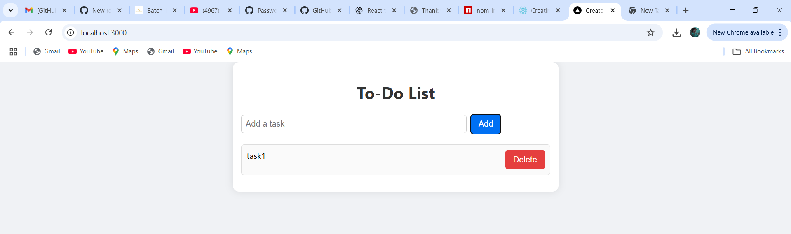

# 📝 Next.js To-Do List App

A simple and lightweight to-do list application built using **Next.js** and **React Hooks**. This app allows users to add and delete tasks with a clean UI and smooth functionality.

---

## 🚀 Features

- Add tasks dynamically
- Delete tasks easily
- Minimal, clean UI
- Built with functional React components using `useState`
- Fully client-rendered using Next.js

---

## 📁 Project Structure

